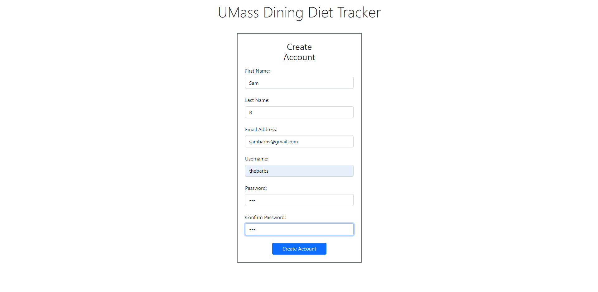
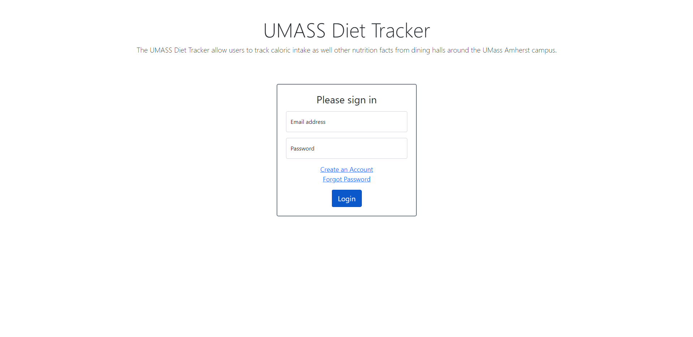
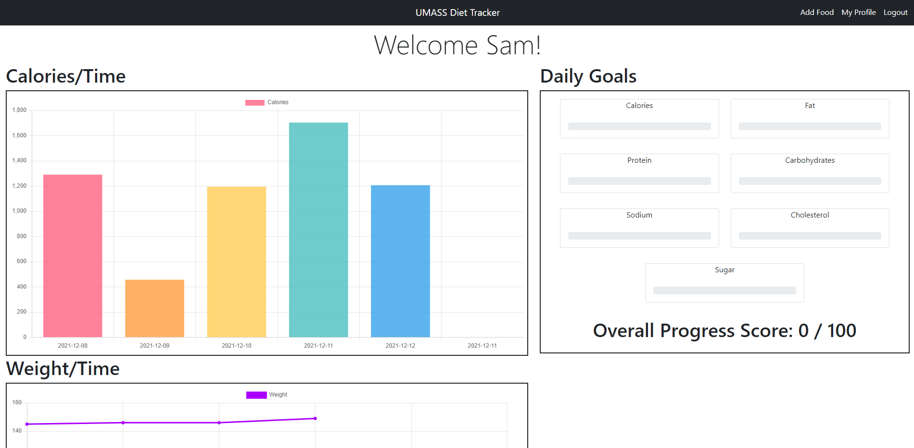
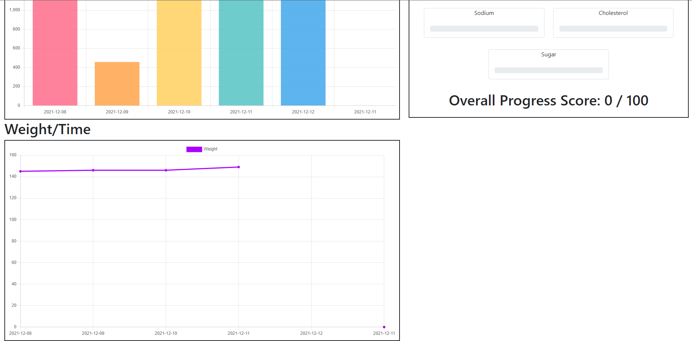
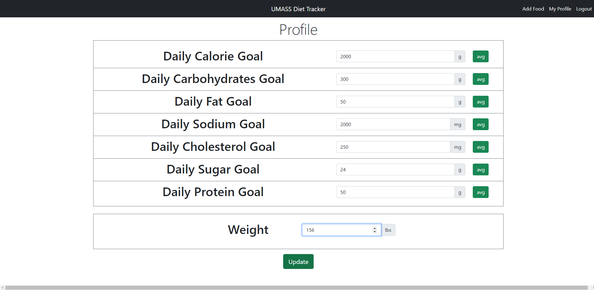
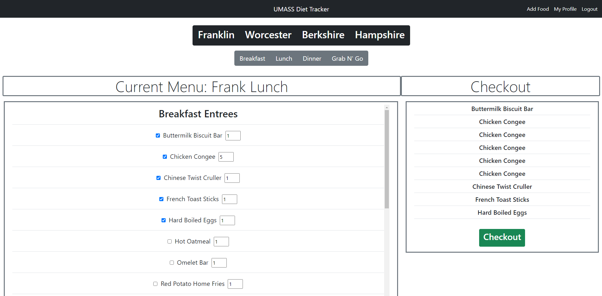
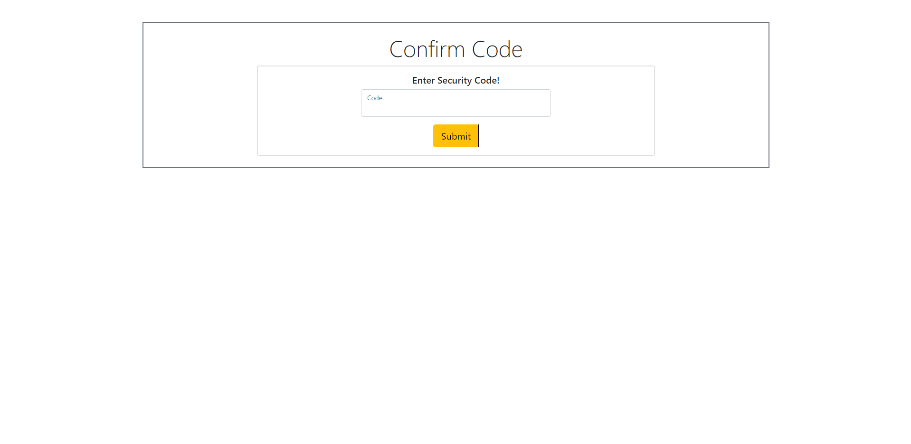
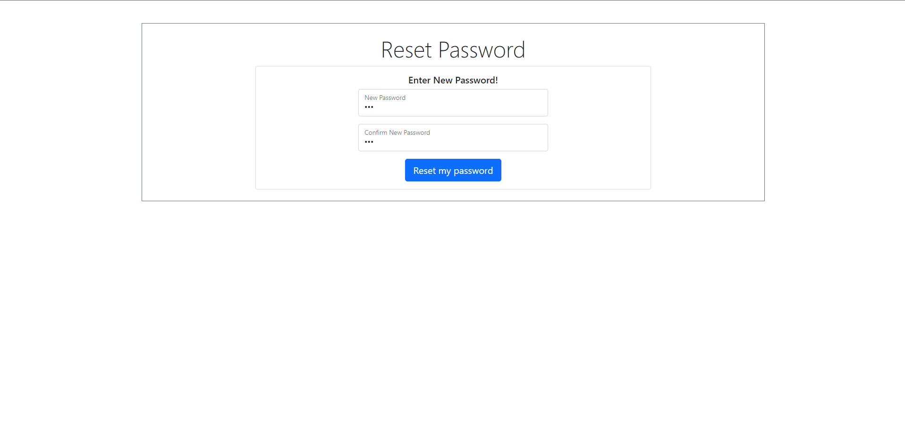

# UMass-Dining-Diet-Tracker

## Contributers
Sam Barber: [18barbers2](https://github.com/18barbers2/) Ilya Pindrus: [ilya-pindrus](https://github.com/ilya-pindrus/) Jakob Parkinson: [jakobparkinson](https://github.com/jakobparkinson/)

## Project Description

We created a web application that allows users to track what they eat at the UMass Amherst dining halls. Knowing the foods and their nutritional values people eat at dining halls is tricky and not easily done with traditional food trackers. Our application acts as a specialization for UMass students who want to track what they eat without the hassle of manually looking up the menu and individual foods. Additionally, the nutritional values we use are accurate; they come from UMass itself. Our application is innovative in its simplicity and utility for UMass students. Diet trackers exist; UMass dining diet trackers did not, until now. Congregating the nutritional information provided by UMass into a simple to use tracker can allow students to easily track dietary intake.

## Caveats

The application is hosted on Heroku at https://umass-dining-diet-tracker.herokuapp.com/ however it has not been maintained. The application may not be functioning as intended as of Dec 11, 2021.

## [Video Demo](https://www.youtube.com/watch?v=FfFniUb_e0g&list=PLbTmqqGclWPKulyyrGo2EIt9z1ZfMprdO&index=21)

## Pictures

### Create Account

## Sign In

## Home Page

## Goals

## Food

## Reset Password

