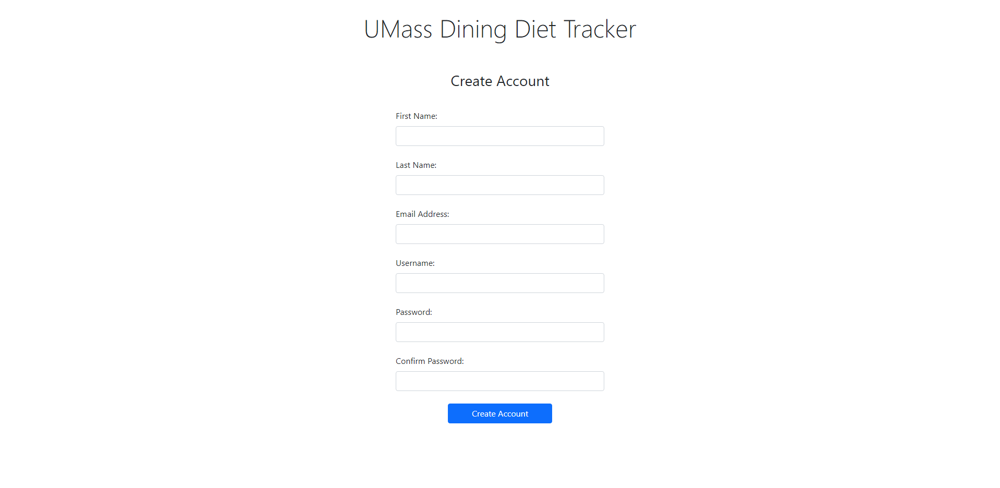

# UMass Diet Tracker Milestone-1

### Data Interactions

- Homepage

Users are able to view the graphs representing the amount of calories consumed over the week. Users are able to monitor their weight over the month which they enter in the profile tab.
Users are able to view the quantity of various macros they have consumed based off of food they recorded in the add food window for the day. 

- Add Food

User clicks on tabs to query food information from the database. Users can select from 4 dining halls, and 4 meals of the day. Users selections are compiled in a list for checkout, once checked out, food selections are calculated into home page statistics.

- Profile

User inputs daily nutrient goals (calories, fats, sodium, cholesterol etc.) Data is sent to the server and updated on the home page.

- Sign-in window

User enters an email address, and password for authentication. The backend code will authenticate the user using a database. 

- Create an account

User inputs credentials (First and Last name, Email, Desired Username, Password, Confirmation Password). Their information will be recorded in a database. 

- Forgot Password Window

If the user forgets their password, they enter their email and a server will send an email with a link to reset their password.  

# Division of Labor

### Data Interactions
Sam, Ilya, Jake

### Wireframe
Sam, Ilya, Jake

### Website
- Homepage
    - Sam, Ilya
- Food Page
    - Jake
- Profile Page
    - Sam
- Sign in Page
    - Ilya
- Create an Account Page
    - Sam
- Forgot Password Page
    - Ilya

# HTML Output

### Home Page

### Food Page

### Profile Page

### Sign in Page

### Create Account Page

### Forget Password Page

