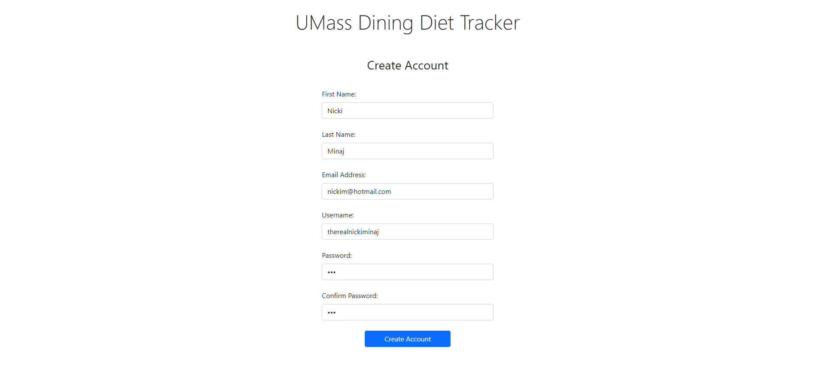
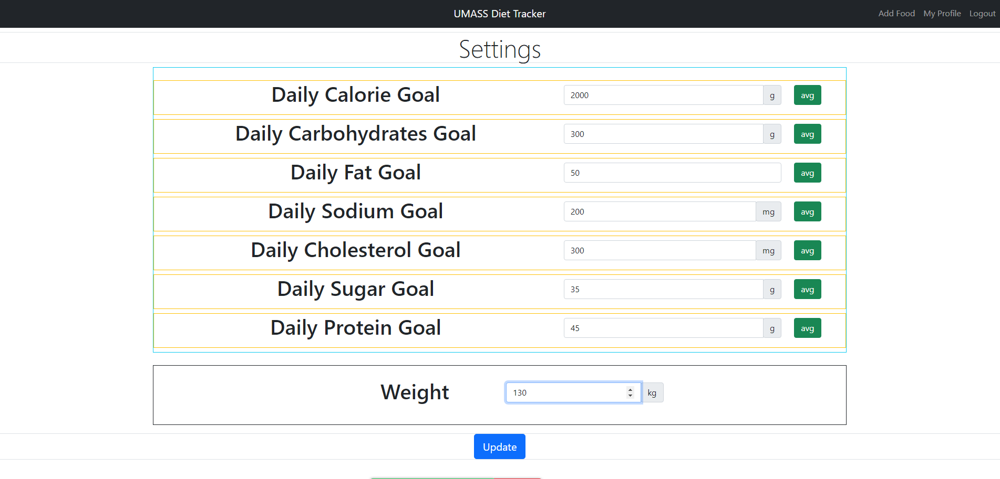

# Milestone 2 Team Gimel

# Project API Planning
### Endpoints

'/sign-in/' -> Serves the sign-in.html page.

'/login/:email/' -> Finds users name based off email param, and returns all their personal nutritional data.

'/checkout-food/ -> Serves the user the add-food.html file.

'/checkout-add/' -> Takes input from selected foods on add-food page, then returns the aggregate nutritional values from those food items.

'/home/' -> Serves the client with the home.html page.

'/profile/' -> Serves the profile.html page to the user.

'/create/account' -> Takes in the request with user account information (we'll use a database here later).

'/delete/password' -> Takes request from client and deletes the password from the database for that user. Then the user will reset their password.

'/forgot-password/' -> Serves the user with the forgot-password.html file.

'/create-account/' -> Serves the user with the create-account.html page.

# CRUD Operations

### Create
When the users first start using the web app, they will have to create an account. We use the '/create/account/' endpoint to perform this operation.

### Read
The 7 fields on the 'home' page, representing daily nutritional values, read from some database (eventually) to track the nutrients the user consumes throughout the day.

### Update
The 'Profile' page, updates values in our database for the nutritional goals on our homepage. 

### Delete
When the user forgets their password the '/delete/password' endpoint tells the database to delete the users password.

# Heroku Hosted Application

